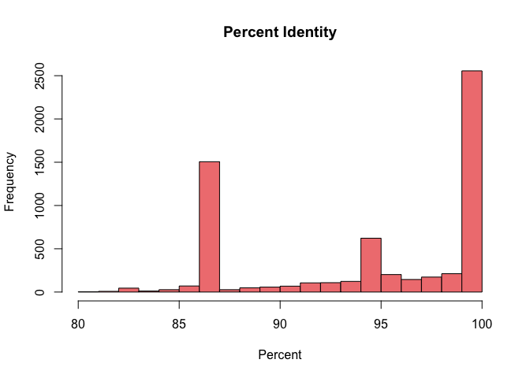
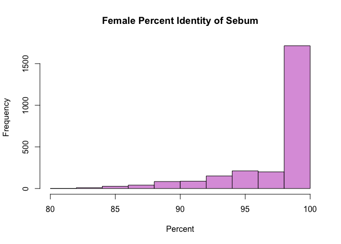
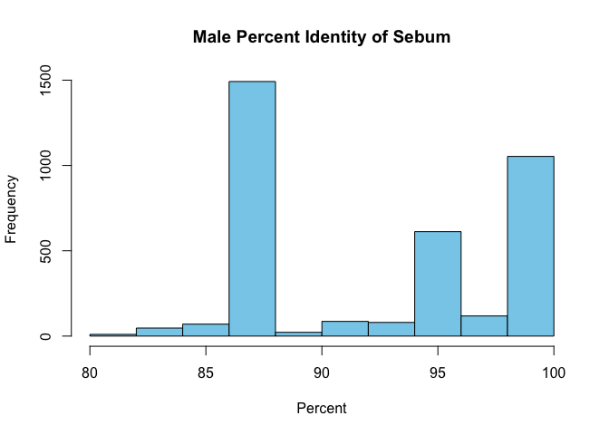
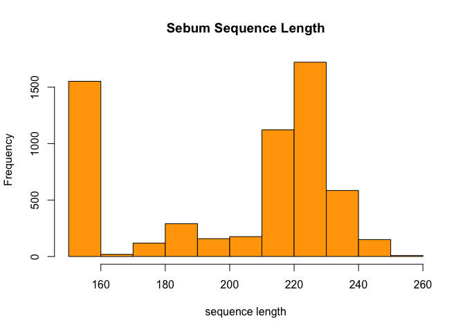
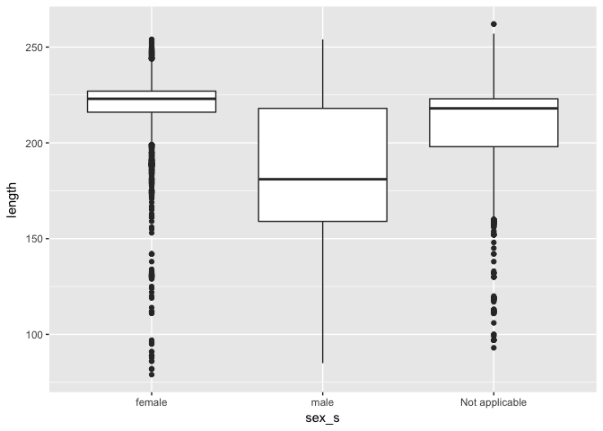

Analysis of BLAST Results
================
Don Francisco
October 6, 2017

Introduction
============

This experiment aimed to proved the validity of using bacterial communities on the skin of humans as a form of forensic identification. This experiement was carried out with the use of human subject, single computer keys, and computer mice. Due to the very high diversity of bacterial communities associated with a particular individual, it was hypothesized that scientists could use the residual skin left on certain objects and match it to the individual who made contact with the particular object or surface even if these objects remained untouched by that individual for a significant period of time. Trough the use of high-thoroughput sequencing techniques, this method of identification was proven to be a highly accuracte method.

Methods
=======

Sample origin and sequencing
----------------------------

A few different sample studies were preformed on different objects in order to test the accuracy of this hypothetical approach. The first study involved swabbing computer keyboards (25–30 keys per keyboard) as well as swabbing the and the skin on the ventral surface of the distal joint of each fingertip of the owner of the keyboard. Swabbing has been shown to be a suffient method of collecting data. Swabbing this specific area of the body was chosen because the biomass levels on the skin are high enough to get a suffient and equal amount of swabs collected per subject. Another study was to designed to test the survival and matching accuracy of the bacterial communities after an extended period of time. This study essentially split the swab samples and froze half of them, while leaving other half to sit in normal, indoor environmental conditions for up to 14 days. The last study swabbed both the palms of the hands of different subjects as well as their computer mouse. Their mice had been last touched 12 hours before collection. To sequence this data, scientists used DNA extraction and pyrosequencing via 454 sequencer.

Computational
-------------

The process to computationally parse and analyze the data that

Results
=======

``` r
# Be sure to install these packages before running this script
# They can be installed either with the intall.packages() function
# or with the 'Packages' pane in RStudio

# load packages
library("dplyr")
```

    ## Warning: package 'dplyr' was built under R version 3.4.2

``` r
library("tidyr")
library("knitr")
library("ggplot2")
```

``` r
# Output format from BLAST is as detailed on:
# https://www.ncbi.nlm.nih.gov/books/NBK279675/
# In this case, we used: '10 sscinames std'
# 10 means csv format
# sscinames means unique Subject Scientific Name(s), separated by a ';'
# std means the standard set of result columns, which are:
# 'qseqid sseqid pident length mismatch
# gapopen qstart qend sstart send evalue bitscore',


# this function takes as input a quoted path to a BLAST result file
# and produces as output a dataframe with proper column headers
# and the 'qseqid' column split into sample and seq number
read_blast_output <- function(filename) {
  data_in <- read.csv(filename,
                      header = FALSE, # files don't have column names in them
                      col.names = c("sscinames", # unique Subject Sci Name(s)
                                    "qseqid",    # Query Seq-id
                                    "sseqid",    # Subject Seq-id
                                    "pident",    # Percntge of identical matches
                                    "length",    # Alignment length
                                    "mismatch",  # Number of mismatches
                                    "gapopen",   # Number of gap openings
                                    "qstart",    # Start of alignment in query
                                    "qend",      # End of alignment in query
                                    "sstart",    # Start of alignment in subj
                                    "send",      # End of alignment in subject
                                    "evalue",    # Expect value
                                    "bitscore"))  # Bit score

  # Next we want to split the query sequence ID into
  # Sample and Number components so we can group by sample
  # They originally look like "ERR1942280.1"
  # and we want to split that into two columns: "ERR1942280" and "1"
  # we can use the separate() function from the tidyr library to do this
  # Note that we have to double escape the period for this to work
  # the syntax is
  # separate(column_to_separate,
  # c("New_column_name_1", "New_column_name_2"),
  # "seperator")
  data_in <- data_in %>%
    separate(qseqid, c("sample_name", "sample_number"), "\\.")
}
```

``` r
# this makes a vector of all the BLAST output file names, including
# the name(s) of the directories they are in
files_to_read_in <- list.files(path = "output/blast",
                               full.names = TRUE)

# We need to create an empty matrix with the right number of columns
# so that we can rbind() each dataset on to it
joined_blast_data <- matrix(nrow = 0,
                            ncol = 14)

# now we loop over each of the files in the list and append them
# to the bottom of the 'joined_blast_data' object
# we do this with the rbind() function and the function we
# made earlier to read in the files, read_blast_output()
for (filename in files_to_read_in) {
  joined_blast_data <- rbind(joined_blast_data,
                             read_blast_output(filename))
}
```

``` r
# Next we want to read in the metadata file so we can add that in too
# This is not a csv file, so we have to use a slightly different syntax
# here the `sep = "\t"` tells the function that the data are tab-delimited
# and the `stringsAsFactors = FALSE` tells it not to assume that things are
# categorical variables
metadata_in <- read.table(paste0("data/metadata/",
                                 "fierer_forensic_hand_mouse_SraRunTable.txt"),
                          sep = "\t",
                          header = TRUE,
                          stringsAsFactors = FALSE)

# Finally we use the left_join() function from dplyr to merge or 'join' the
# combined data and metadata into one big table, so it's easier to work with
# in R the `by = c("Run_s" = "sample_name")` syntax tells R which columns
# to match up when joining the datasets together
joined_blast_data_metadata <- metadata_in %>%
  left_join(joined_blast_data,
            by = c("Run_s" = "sample_name"))
```

``` r
# Here we're using the dply piping syntax to select a subset of rows matching a
# criteria we specify (using the filter) function, and then pull out a column
# from the data to make a histogram. We don't need to tell the hist() function
# which data to use, because that's piped in, but we do have to give the
# hist() function the title and axis label we'd like to use for the figure
joined_blast_data_metadata %>%
  filter(env_material_s == "sebum") %>%
  pull(pident) %>%
  hist(main = "Percent Identity",
       xlab = "Percent",
       col = "lightcoral")
```



Figure 1. Histogram showing the percent identity matches of sebum in male and female subjects.

``` r
joined_blast_data_metadata %>%
filter(env_material_s == "dust") %>%
filter(sample_type_s == "computer mouse") %>%
  pull(pident) %>%
  hist(main = "Percent Dust Found on Computer Mice",
       xlab = "Percent",
       col = "forest green") 
```


Figure 2. This histogram shows the bacterial percent identity in dust found on computer mice.

``` r
joined_blast_data_metadata %>%
filter(env_material_s == "sebum") %>%
filter(sex_s == "female") %>%
  pull(pident) %>%
  hist(main = "Female Percent Identity of Sebum",
       xlab = "Percent",
       col = "plum")
```



Figure 3. This graph shows that between the percent bacterial identity of sebum found on both genders, females palms exhibited a very high percentage.

``` r
joined_blast_data_metadata %>%
filter(env_material_s == "sebum") %>%  
filter(sex_s == "male") %>%
  pull(pident) %>%
  hist(main = "Male Percent Identity of Sebum",
       xlab = "Percent",
       col = "skyblue")
```



Figure 4. This graph shows that among the bacterial identities in the sebum samples taken, male hands had a significantly lower match than that of females.

``` r
joined_blast_data_metadata %>%
filter(env_material_s == "sebum") %>%
filter(length > 150) %>%
  pull(length) %>%
  hist(main = "Sebum Sequence Length",
       xlab = "sequence length",
       col = "orange")
```



Figure 5. This graph shows the sequence length matches (in bp) on both males and female hands for sequence lengths over 150.

``` r
ggplot(joined_blast_data_metadata,
       aes(x = sex_s,
           y = length)) +
  geom_boxplot()
```



``` r
joined_blast_data_metadata %>%
  group_by(sscinames) %>%
  count() %>%
  arrange(desc(n)) %>%
  head(10) %>% 
  kable(digits = 5)
```

| sscinames                                              |     n|
|:-------------------------------------------------------|-----:|
| Solemya pervernicosa gill symbiont                     |  2372|
| Bartonella washoensis                                  |  1583|
| Bacteroidetes endosymbiont of Metaseiulus occidentalis |  1164|
| Aquitalea sp. KJ011                                    |   571|
| unidentified bacterium                                 |   420|
| Pinus oocarpa                                          |   392|
| Staphylococcus succinus                                |   367|
| Acidovorax sp.                                         |   346|
| Spiroplasma corruscae                                  |   308|
| Propionibacterium acnes subsp. acnes                   |   126|

Table 1: Table 1 showing the top 10 bacterial identity matches and their corresponding sequence lengths

``` summary
# Finally, we'd like to be able to make a summary table of the counts of
# sequences for each taxa for each sample. To do that we can use the table()
# function. We add the kable() function as well (from the tidyr package)
# in order to format the table nicely when the document is knitted
kable(table(joined_blast_data_metadata$sscinames,
            joined_blast_data_metadata$Run_s))
```

Discussion
==========

Add 2-3 paragraphs here interpreting your results and considering future directions one might take in analyzing these data.
